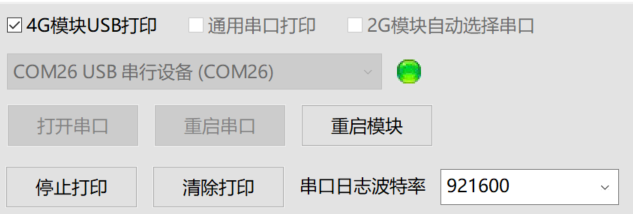

# 烧录教程

> 视频教程参见此处：[【LuatOS】①烧录教程](https://www.bilibili.com/video/BV1Mq4y1e7Eb)

## 串口烧录

准备工作：

一根typec口的USB连接线

一台window系统的电脑（推荐win10以上）

### 工具配置

首先下载最新版本的Luatools：[点我下载](https://luatos.com/luatools/download/last)

建议新建一个Luatools文件夹，将exe文件放入其中后，再打开exe文件

::::{tab-set}

:::{tab-item} Air101/Air103
:sync: air101

请勾选`通用串口打印`

修改通用串口波特率，设置波特率为921600

将设备通过usb线连接到电脑，可以看到出现一个新的COM口，在工具中选中这个COM口并打开

:::

:::{tab-item} Air105
:sync: air105

请勾选`通用串口打印`

修改通用串口波特率，设置波特率为1500000

将设备通过usb线连接到电脑，可以看到出现一个新的COM口，在工具中选中这个COM口并打开

:::

:::{tab-item} ESP32C3简约版
:sync: c3usb

请勾选`通用串口打印`

无需修改串口波特率，保持当前值即可

将设备通过usb线连接到电脑，可以看到出现一个新的COM口，在工具中选中这个COM口并打开

:::

:::{tab-item} ESP32C3经典版
:sync: c3uart

请勾选`通用串口打印`

修改通用串口波特率，设置波特率为921600

将设备通过usb线连接到电脑，可以看到出现一个新的COM口，在工具中选中这个COM口并打开

:::

:::{tab-item} Air780
:sync: air780

请勾选`4G模块USB打印`

无需修改串口波特率，保持当前值即可

将设备通过usb线连接到电脑，可以看到出现3个新的COM口，工具会自动打开端口

:::

::::

### 烧录固件

烧录前需要获取固件

::::::{tab-set}

:::::{tab-item} 工具自动下载的固件

::::{tab-set}

:::{tab-item} Air101/Air103
:sync: air101

找到Luatools所在的文件夹，文件夹的`Luatools/resource/101_lua_lod`或`Luatools/resource/103_lua_lod`中的就是自动下载的正式版本固件

:::

:::{tab-item} Air105
:sync: air105

找到Luatools所在的文件夹，文件夹的`Luatools/resource/105_lua_lod`中的就是自动下载的正式版本固件

:::

:::{tab-item} ESP32C3简约版
:sync: c3usb

找到Luatools所在的文件夹，文件夹的`Luatools/resource/esp32c3_lua_lod/版本号`中带有`USB`字样的，就是自动下载的正式版本固件

:::

:::{tab-item} ESP32C3经典版
:sync: c3uart

找到Luatools所在的文件夹，文件夹的`Luatools/resource/esp32c3_lua_lod/版本号`中**不带有**`USB`字样的，就是自动下载的正式版本固件

一定要安装CH343的驱动才能正常下载固件，默认的CDC驱动打印日志没问题，但是速率太慢会导致下载失败。[驱动传送门](http://www.wch.cn/downloads/CH343SER_EXE.html)

:::

:::{tab-item} Air780
:sync: air780

找到Luatools所在的文件夹，文件夹的`Luatools/resource/`中就是自动下载的正式版本固件

:::

::::

:::::

:::::{tab-item} 前往官方仓库下载固件

也可以前往LuatOS官方仓库下载最新固件

正式版可以在发行版页面下载：

[https://gitee.com/openLuat/LuatOS/releases](https://gitee.com/openLuat/LuatOS/releases)

:::::

:::::{tab-item} 使用云编译

也可以使用官方的**云编译**功能，自定义固件中包含的模块

[云编译教程点我查看](https://wiki.luatos.com/develop/compile/Cloud_compilation.html)

固件下载后解压，可以得到相应的固件

:::::

::::::

固件是拓展名为`soc`的文件，这里用Air101的固件进行举例，长这样：

接着返回Luatools，点击`下载固件`按钮，选中刚刚下载的soc文件，直接下载即可：

### 烧录脚本

点击`项目管理测试`按钮，点击左下角的`创建项目`新建一个新项目

选好芯片使用的固件，选好脚本即可下载

demo类的脚本，可以前往[LuatOS官方仓库](https://gitee.com/openLuat/LuatOS)，在`demo`文件夹可以找到

Luatools工具也自动下载了正式版本的一些实例脚本可以在`resource\某种型号\某个版本\demo`文件夹看到，可以直接选择脚本进行烧录测试

如果芯片当前已经烧录的固件版本，和这里选择的固件相同，那么可以点击`下载脚本`只下载脚本；反之，建议点击`下载底层和脚本`，进行全刷

### 查看日志

如果没有打开串口，点击`打开串口`即可查看日志

如果还没反应，检查通用串口打印是否勾选， 重新选择串口打开，或者试试点击`重启串口`

