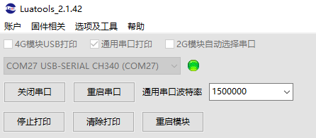
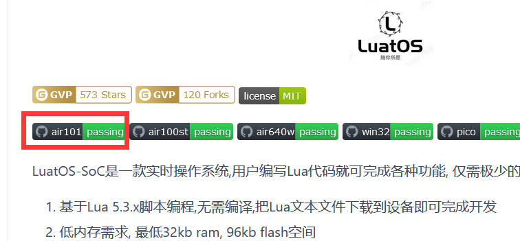
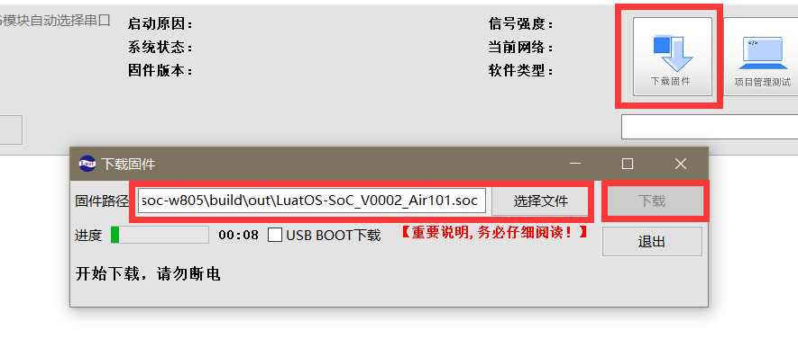
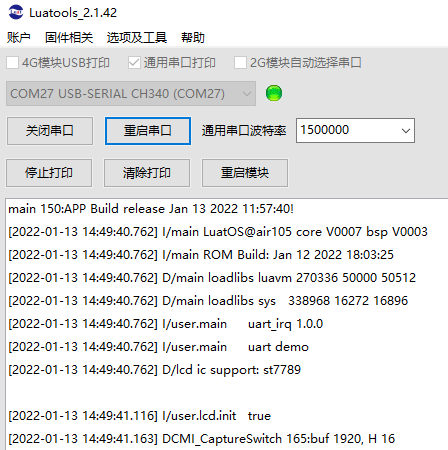

# 烧录教程

## 串口烧录

准备工作：

一根typec口的USB连接线

一台window系统的电脑（推荐win10以上）

### 工具配置

首先下载最新版本的Luatools：[点我下载](https://luatos.com/luatools/download/last)

建议新建一个Luatools文件夹，将exe文件放入其中后，再打开exe文件

选择`选项及工具`--`工具配置`

在`uart`选项卡，设置波特率为芯片专属的烧录波特率（如：Air101使用的是921600）

如果是第一批开发板第一次使用官方开发板，有可能会提示未激活，建议点击`账户`--`登录`按提示操作即可，用户名为购买人手机号，密码默认八个8，后面的开发板出厂已经激活，不再需要激活了

[详细激活教程](https://doc.openluat.com/article/3608)

### 烧录固件

将设备通过usb线连接到电脑，可以看到出现一个新的COM口，勾选`通用串口打印`，并在工具中选中这个COM口

前往LuatOS官方仓库下载最新固件

正式版可以在发行版页面下载：

[https://gitee.com/openLuat/LuatOS/releases](https://gitee.com/openLuat/LuatOS/releases)

快照版可以直接点击[LuatOS官方仓库readme](https://gitee.com/openLuat/LuatOS)中，对应的徽标下载：

固件下载后解压，可以得到相应的固件，拓展名为soc的文件，这里用Air101的固件进行举例：

（或者找到Luatools所在的文件夹，文件夹的`resource\对应文件夹`也会自动下载正式版本的固件）

接着返回Luatools，点击`下载固件`按钮，选中刚刚下载的soc文件，直接下载即可：

### 烧录脚本

点击`项目管理测试`按钮，点击左下角的`创建项目`新建一个新项目

选好芯片使用的固件，选好脚本即可下载

demo类的脚本，可以前往[LuatOS官方仓库](https://gitee.com/openLuat/LuatOS)，在`bsp/对应型号/demo`文件夹可以找到

Luatools工具也自动下载了正式版本的一些实例脚本可以在`resource\某种型号\某个版本\demo`文件夹看到，可以直接选择脚本进行烧录测试

如果芯片当前已经烧录的固件版本，和这里选择的固件相同，那么可以点击`下载脚本`只下载脚本；反之，建议点击`下载底层和脚本`，进行全刷

### 查看日志

如果没有打开串口，点击`打开串口`即可查看日志

如果还没反应，可以试试点击`重启串口`

