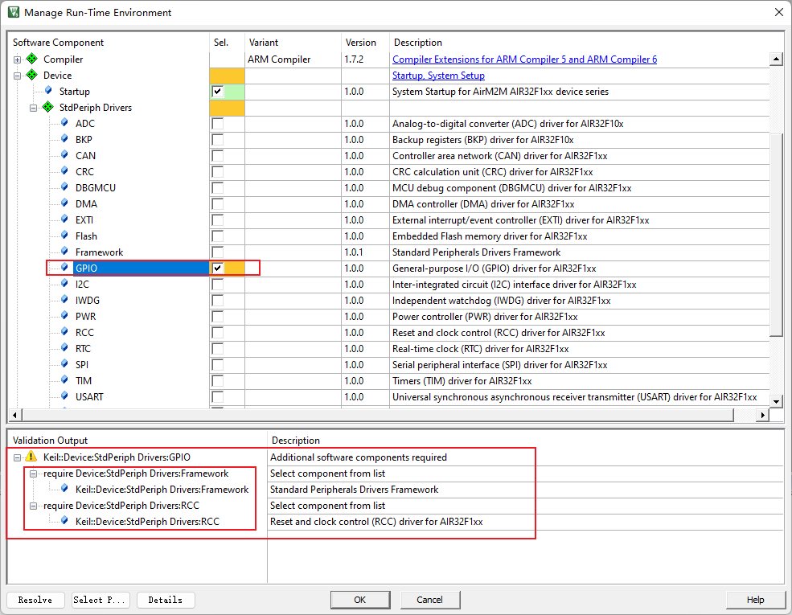
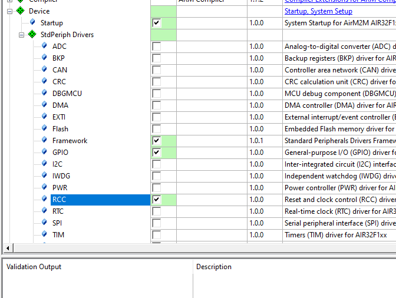

# Air32F103使用手册

## 一、背景

- 背景：本文档主要解决Air32F103系列芯片的KEIL开发环境搭建相关问题

- 技术定位：初级/中级/高级

- 目标群体：使用KEIL进行开发的用户

## 二、环境搭建

### 准备工作

1. 安装MDK5，具体方法请百度，安装后需要激活才能编译大文件
2. 下载安装AIR32F103的SDK：[https://gitee.com/openLuat/luatos-soc-air32f103/](https://gitee.com/openLuat/luatos-soc-air32f103/)

### 安装支持包

找到AIR_Jlink_Keil文件夹中最新版本的pack文件，双击安装即可，安装后可在keil设备列表的Generic下看到AIR32设备


### 新建工程

点击菜单栏的Project->New μVision Project


创建文件夹和工程名，路径根据自己实际选


选择设备列表中的Generic下的AIR32F103CBT6


添加启动文件，勾选CMSIS下的CORE和Device下的Startup，即可自动配置启动文件


添加外设库支持，例如添加GPIO库，勾选GPIO组件以后可以看到下面会提示缺少其他组件，根据提示勾选即可，也可以全部勾选



根据提示勾选缺少的依赖以后就消除了提示，点击OK工程就建立好了。



添加库函数定义


### 测试代码

点击左上角新建一个文件，右键保存为main.c，添加一个main函数

```c
int main(void)
{
	while(1);
}
```

点击编译按钮测试是否能编译成功。

## 三、下载烧录

Air32F103开发板出厂默认为DAPLINK固件，所以可以直接作为调试器给另一个设备调试烧录。这里介绍DAPLINK的使用方法，其他调试器类似。

> 注意，由于**win7**系统不自带`winusb`驱动，且该系统早在2020年微软就已停止支持，所以如需使用DAPLINK功能，请升级至**win8以上系统**，或自行手动安装驱动：[Zadig驱动安装器](https://zadig.akeo.ie/)

AIR32F103开发板的DAPLINK固件，PB13连接被调试设备的SWDCLK，PB14连接被调试设备的SWDIO，PB0连接复位：

|引脚|功能|
|:-:|:-:|
|PB13|SWD_CLK|
|PB14|SWD_DIO|
|PB0|RST复位|
|PA2|虚拟串口的TX|
|PA3|虚拟串口的RX|

整体连接图如下图所示：


点击工程配置魔术棒，找到Debug选项卡，在下拉列表中选择CMSIS-DAP Debugger，点击Settings


查看设备是否连接正常，连接正常可以在SW Device列表里看到设备，可以调整时钟速度提高效率


点击Flash Download选项卡，可以看到我们的支持包已经默认帮我们添加了下载算法，我们可以勾选Reset and Run选项卡，每次下载完自动复位运行代码，就不用手动按复位按钮了。


配置完成以后就可以直接点击烧录按钮下载烧录代码到设备了。

> 由于开发板默认的daplink固件封堵了SWD调试接口，所以第一次使用swd下载时，请先按住被调试板子的BOOT按键，再按一下复位按键，最后松开BOOT按键，然后点击keil中的下载按钮。第一次下载完成后，下次下载就不用这样操作了（或在下载前先按住被调试板子的复位按键，在点击keil的下载按钮后马上松开按键/或者直接用ISP工具擦除芯片）
